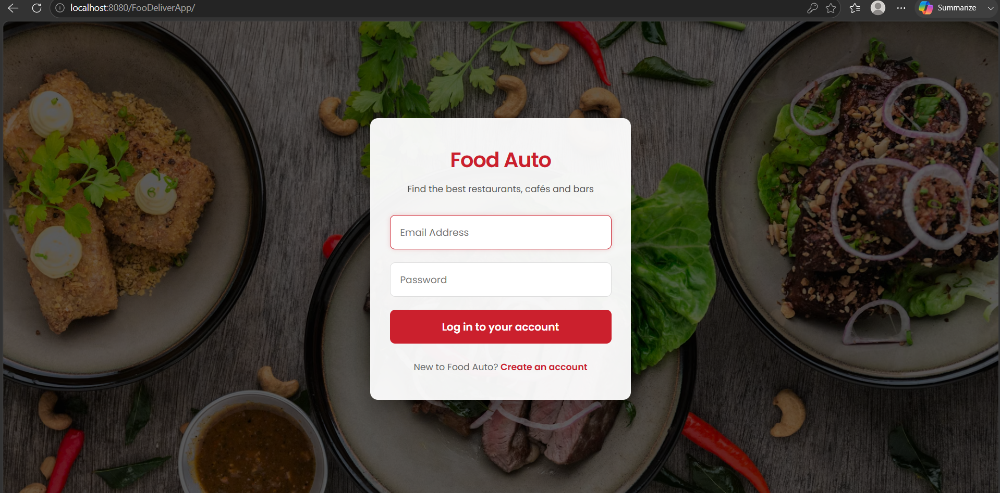
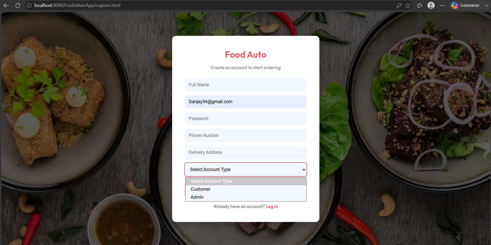
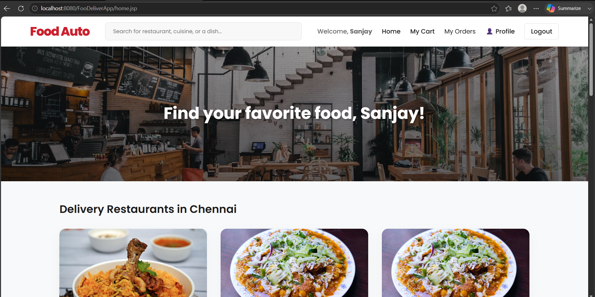
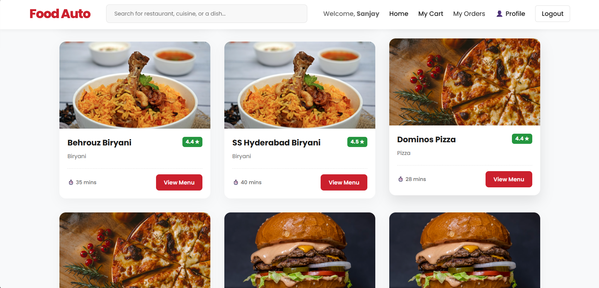
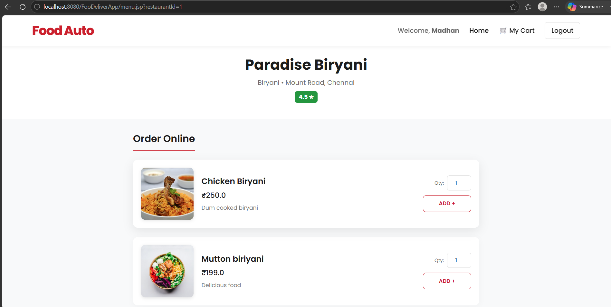
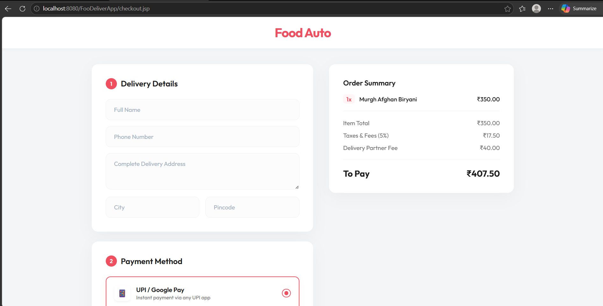
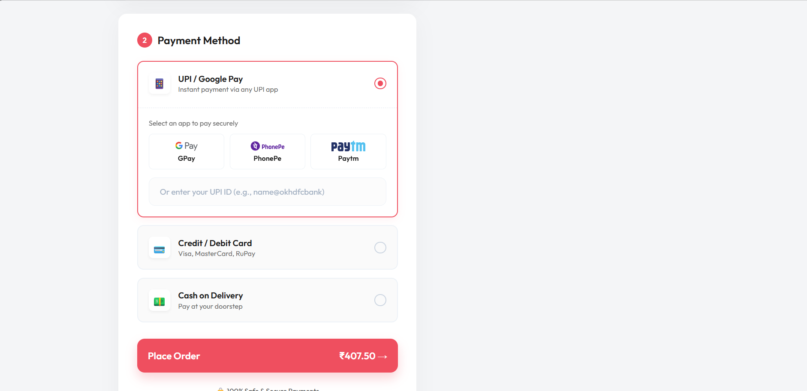
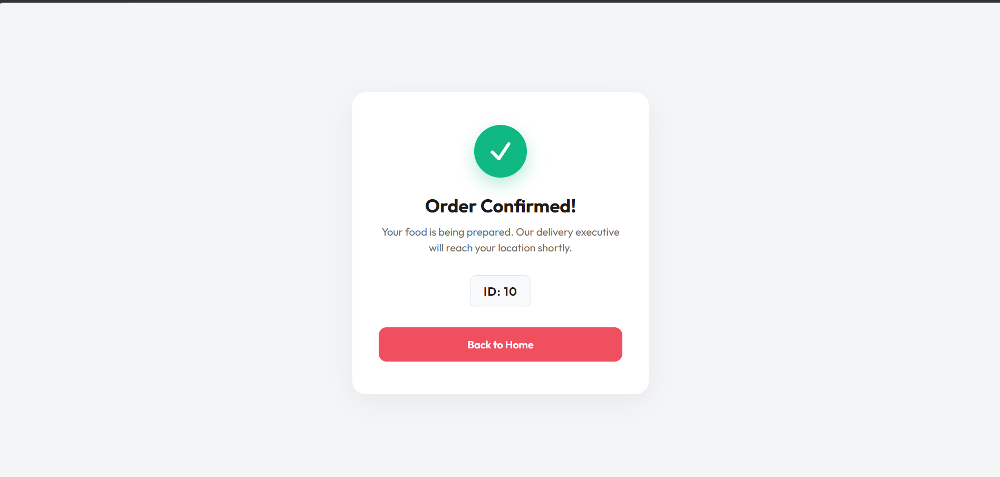

# 🍔 Food-Auto

<div align="center">

### A Full Stack Food Ordering Web Application

Built using **Java • JSP • Servlets • JDBC • MySQL • HTML • CSS • JavaScript**


# 📌 About The Project

Food-Auto is a **Full Stack Food Ordering Web Application** inspired by platforms like **Swiggy** and **Zomato**.

The application enables users to browse restaurants, explore menus, add food items to their cart, complete secure checkout, and place orders. It also includes an **Admin Panel** for managing restaurants, menus, and customer orders.

The project follows the **MVC Architecture** and demonstrates real-world implementation of **Java Web Development** using Servlets, JSP, JDBC, and MySQL.

# 🚀 Features

## 👤 Customer Module

- User Registration
- Secure Login
- Browse Restaurants
- Search Restaurants
- View Restaurant Menu
- Add to Cart
- Update Cart Quantity
- Checkout
- Multiple Payment Options
- Order Confirmation
- View Order History
- User Profile

## 👨‍💼 Admin Module

- Admin Login
- Restaurant Management
- Menu Management
- Customer Management
- Order Management

# 🛠 Tech Stack

### Frontend

- HTML5
- CSS3
- JavaScript
- JSP

### Backend

- Java
- Servlets
- JDBC

### Database

- MySQL

### Server

- Apache Tomcat 9

### IDE

- Eclipse IDE

### Version Control

- Git
- GitHub

# 🏗 Project Structure
```
FoodDeliveryApp
│
├── src/main/java
│   ├── Controller
│   ├── DAO
│   ├── DAO Implementation
│   ├── Model
│   └── Utility
│
├── src/main/webapp
│   ├── HTML
│   ├── JSP
│   ├── CSS
│   └── Images
│
└── MySQL Database
```

# 📸 Application Screenshots

## 🔐 Login Page



## 📝 Registration Page



## 🏠 Home Page



## 🍽 Restaurant Listing



## 📖 Restaurant Menu



## 🛒 Shopping Cart

.png)

## 💳 Checkout Page



## 💰 Payment Page



## ✅ Order Confirmation



# ⚙️ Installation

## Clone Repository

```bash
git clone https://github.com/Mjn-001/Food-Auto.git
```

Open the project using **Eclipse IDE**.

Import it as a **Dynamic Web Project**.

Configure **Apache Tomcat 9**.

Create the required MySQL database.

Update the JDBC connection credentials.

Run the application on Tomcat.

Open:

```
http://localhost:8080/FoodDeliveryApp/
```

---

# 🗄 Database Configuration

Update your JDBC credentials before running.

Example:

```java
String url = "jdbc:mysql://localhost:3306/foodauto";
String username = "root";
String password = "your_password";
```

# 🔄 Application Workflow

```
User Registration/Login
          │
          ▼
Browse Restaurants
          │
          ▼
View Menu
          │
          ▼
Add Food to Cart
          │
          ▼
Checkout
          │
          ▼
Payment
          │
          ▼
Order Confirmation
```

# ✨ Highlights

- Full Stack Java Web Application
- MVC Architecture
- JDBC Connectivity
- Session Management
- CRUD Operations
- Dynamic JSP Pages
- Responsive UI
- Restaurant Search
- Shopping Cart
- Checkout System
- Order Management
- Admin Dashboard
- Clean Code Structure

# 🚀 Future Enhancements

- Online Payment Gateway Integration
- Email Notifications
- OTP Verification
- Google Maps Integration
- Live Order Tracking
- Restaurant Reviews
- Ratings System
- Responsive Mobile Design
- Spring Boot Migration
- Docker Deployment
- Cloud Hosting

# ▶️ Running the Project

### Requirements

- Java JDK 8+
- Eclipse IDE
- Apache Tomcat 9
- MySQL Server

Run the project on Tomcat.

Access it at:

```
http://localhost:8080/FoodDeliveryApp/
```

---

# 👨‍💻 Developer

## Madhan

Engineering Student • Full Stack Java Developer • Content Creator

GitHub:

https://github.com/Mjn-001


# ⭐ Support

If you found this project helpful,

### ⭐ Star this repository on GitHub!

It helps others discover the project and motivates further development.

## Thank You ❤️
